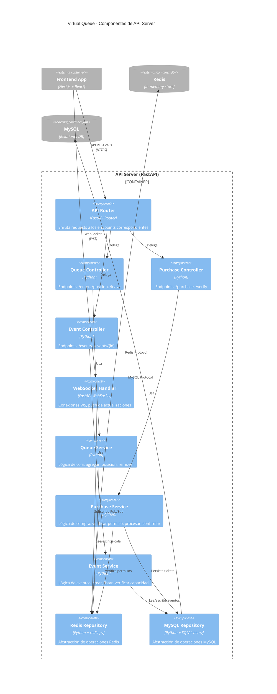
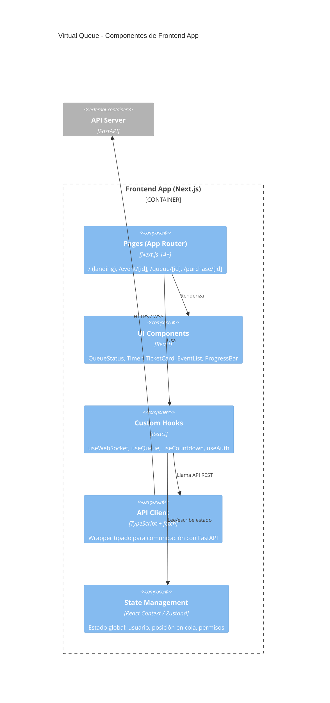
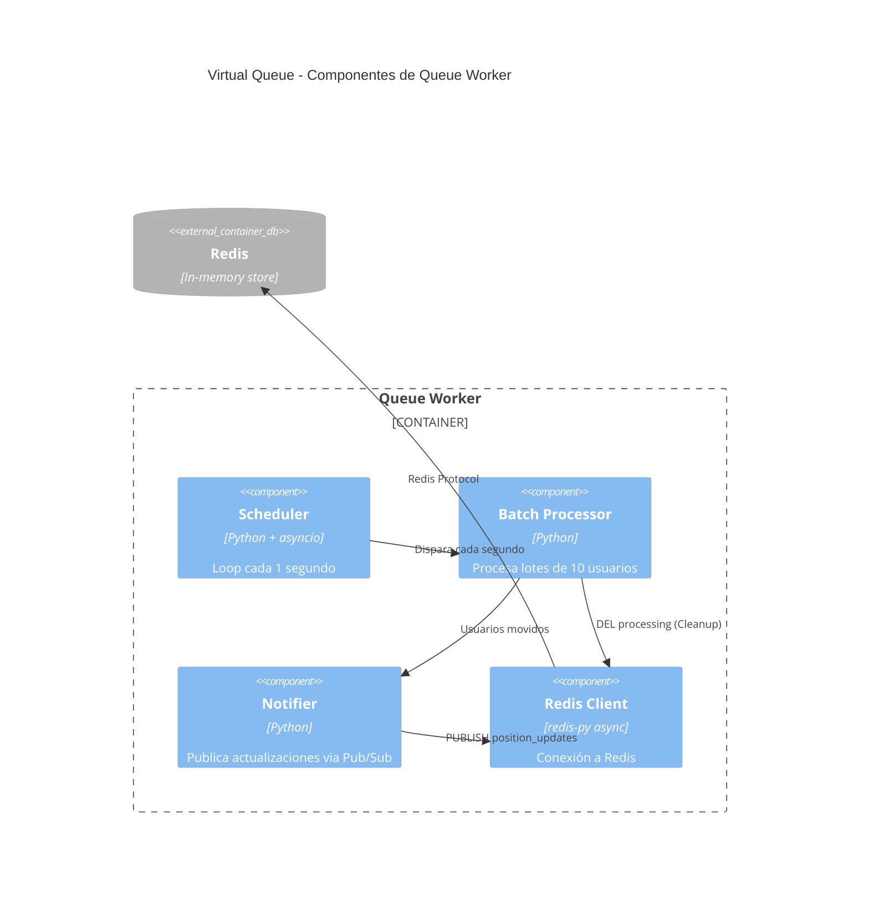

# C4 Nivel 3: Diagrama de Componentes

## Descripción

Este diagrama muestra los componentes internos del API Server (FastAPI) y del Frontend App (Next.js), detallando servicios, controladores y su interacción.

## Diagrama - API Server



## Componentes del API Server

### Controllers (Capa de Presentación)

| Componente | Endpoints | Responsabilidad |
|------------|-----------|-----------------|
| **Queue Controller** | `POST /api/queue/enter`<br>`GET /api/queue/position/{id}`<br>`DELETE /api/queue/leave/{id}` | Manejar entrada/salida de cola |
| **Purchase Controller** | `POST /api/tickets/purchase`<br>`GET /api/tickets/verify/{id}` | Procesar y verificar compras |
| **Event Controller** | `GET /api/events`<br>`GET /api/events/{id}`<br>`POST /api/events` (admin) | CRUD de eventos |
| **WebSocket Handler** | `WS /ws/{user_id}` | Conexiones persistentes, push de actualizaciones de posición |

### Services (Capa de Aplicación)

| Componente | Métodos Principales | Lógica de Negocio |
|------------|---------------------|-------------------|
| **Queue Service** | `enter_queue()`, `get_position()`, `leave_queue()` | Asignar posición, calcular espera estimada |
| **Purchase Service** | `verify_permission()`, `process_purchase()`, `confirm()` | Verificar TTL, decrementar capacidad atómicamente |
| **Event Service** | `create()`, `get_available()`, `check_capacity()` | Validar fechas, verificar stock |

### Repositories (Capa de Infraestructura)

| Componente | Operaciones |
|------------|-------------|
| **Redis Repository** | `lpush()`, `queue_pop_safe()` (Lua), `llen()`, `hset()`, `hget()`, `hdel()`, `publish()` |
| **MySQL Repository** | `insert_ticket()`, `insert_buyer()`, `insert_payment()`, `get_event()`, `update_capacity()` |

---

## Diagrama - Frontend App



### Páginas (App Router)

| Ruta | Componente | Descripción |
|------|------------|-------------|
| `/` | `page.tsx` | Landing — lista de eventos disponibles |
| `/event/[id]` | `page.tsx` | Detalle del evento, botón "Entrar a la cola" |
| `/queue/[id]` | `page.tsx` | Sala de espera — posición en tiempo real, barra de progreso |
| `/purchase/[id]` | `page.tsx` | Pantalla de compra — timer de 5 min, formulario de pago |

### Custom Hooks

| Hook | Responsabilidad |
|------|-----------------|
| `useWebSocket(url)` | Conectar/reconectar WebSocket, parsear mensajes |
| `useQueue(eventId)` | Estado de la cola: posición, estimado, turno |
| `useCountdown(seconds)` | Timer regresivo para TTL de 5 minutos |
| `useAuth()` | Session token del usuario |

---

## Diagrama - Queue Worker



### Flujo del Worker

```python
# Pseudocódigo del Worker
async def process_batch():
    while True:
        # 1. Mover lote de la cola a lista de procesamiento (atómico via Lua)
        users = await redis_repo.queue_pop_safe(event_id, batch_size=10)
        
        for user_id in users:
            # 2. Agregar a permitidos con TTL de 5 minutos
            await redis_repo.set_allowed(event_id, user_id, ttl=300)
        
        # 3. Limpiar lista de procesamiento (batch exitoso)
        await redis_repo.clear_processing(event_id)
        
        # 3. Notificar a todos los conectados
        await redis.publish("position_updates", json.dumps({
            "moved": len(users),
            "queue_length": await redis.llen("waiting_queue")
        }))
        
        # 4. Esperar 1 segundo
        await asyncio.sleep(1)
```
