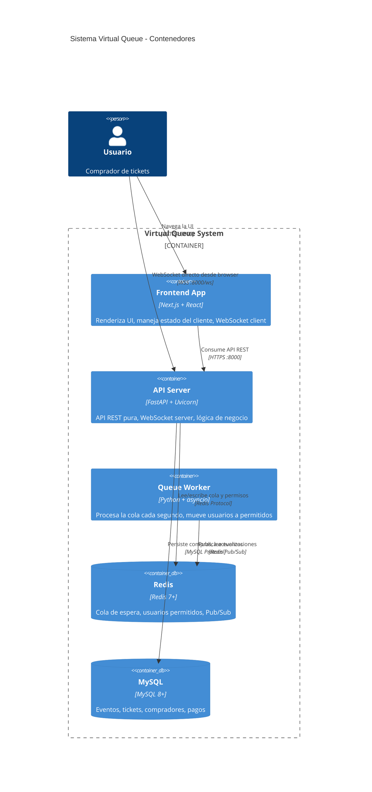

# C4 Nivel 2: Diagrama de Contenedores

## Descripción

Este diagrama muestra los contenedores (aplicaciones, bases de datos, servicios) que componen el sistema Virtual Queue y cómo se comunican entre sí.

## Diagrama



## Contenedores

### Aplicaciones

| Contenedor | Tecnología | Responsabilidad |
|------------|------------|-----------------|
| **Frontend App** | Next.js 14+ / React 18+ | Renderizado SSR/CSR, páginas, hooks de WebSocket, state management |
| **API Server** | FastAPI + Uvicorn | API REST pura, WebSocket server, lógica de negocio |
| **Queue Worker** | Python + asyncio | Proceso background que mueve usuarios de cola a permitidos |

### Almacenamiento

| Contenedor | Tecnología | Datos |
|------------|------------|-------|
| **Redis** | Redis 7+ | `waiting_queue` (LIST), `allowed_users` (HASH), `positions` (PubSub) |
| **MySQL** | MySQL 8+ | `events`, `tickets`, `buyers`, `payments`, `queue_history` |

## Flujo de Datos

```
1. Usuario → Frontend: Navega a la página del evento
2. Frontend → API: POST /api/queue/enter
3. API → Redis: LPUSH waiting_queue {user_id}
4. API → Frontend: {position: 500, queue_id: "abc123"}
5. Browser → API: Conectar WebSocket :8000/ws

[Cada 1 segundo]
6. Worker → Redis: LPOP waiting_queue (x10)
7. Worker → Redis: HSET allowed_users {user_id} (TTL 5min)
8. Worker → Redis: PUBLISH position_updates {...}
9. Redis → API (WS server): Recibe mensaje
10. API → Browser: {new_position: 400}

[Cuando es su turno]
11. Usuario → Frontend: Clic en "Comprar"
12. Frontend → API: POST /api/tickets/purchase
13. API → Redis: HGET allowed_users {user_id}
14. API → MySQL: INSERT INTO tickets...
15. API → Redis: HDEL allowed_users {user_id}
```
