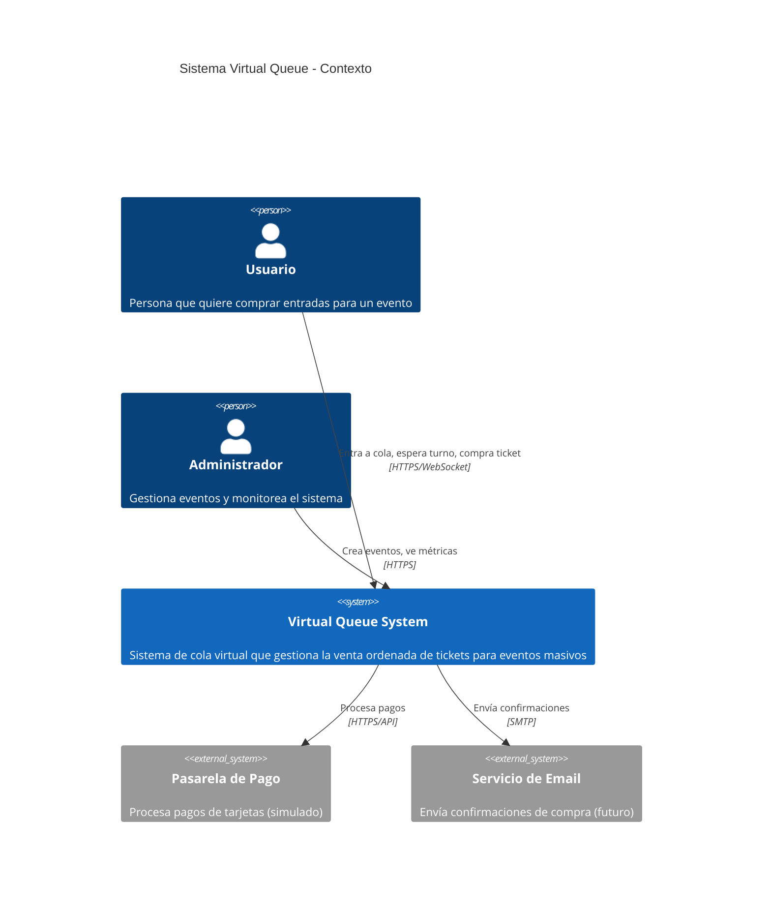

# C4 Nivel 1: Diagrama de Contexto del Sistema

## Descripción

Este diagrama muestra el sistema Virtual Queue desde el nivel más alto, identificando los usuarios y sistemas externos con los que interactúa.

## Diagrama

## Actores

| Actor | Descripción | Interacción |
|-------|-------------|-------------|
| **Usuario** | Persona que desea comprar entradas | Entra a la cola, ve su posición en tiempo real, compra cuando es su turno |
| **Administrador** | Operador del sistema | Crea eventos, define capacidad, monitorea ventas |

## Sistemas Externos

| Sistema | Propósito | Estado |
|---------|-----------|--------|
| **Pasarela de Pago** | Procesar transacciones | Simulado en MVP |
| **Servicio de Email** | Enviar confirmaciones | Futuro |
