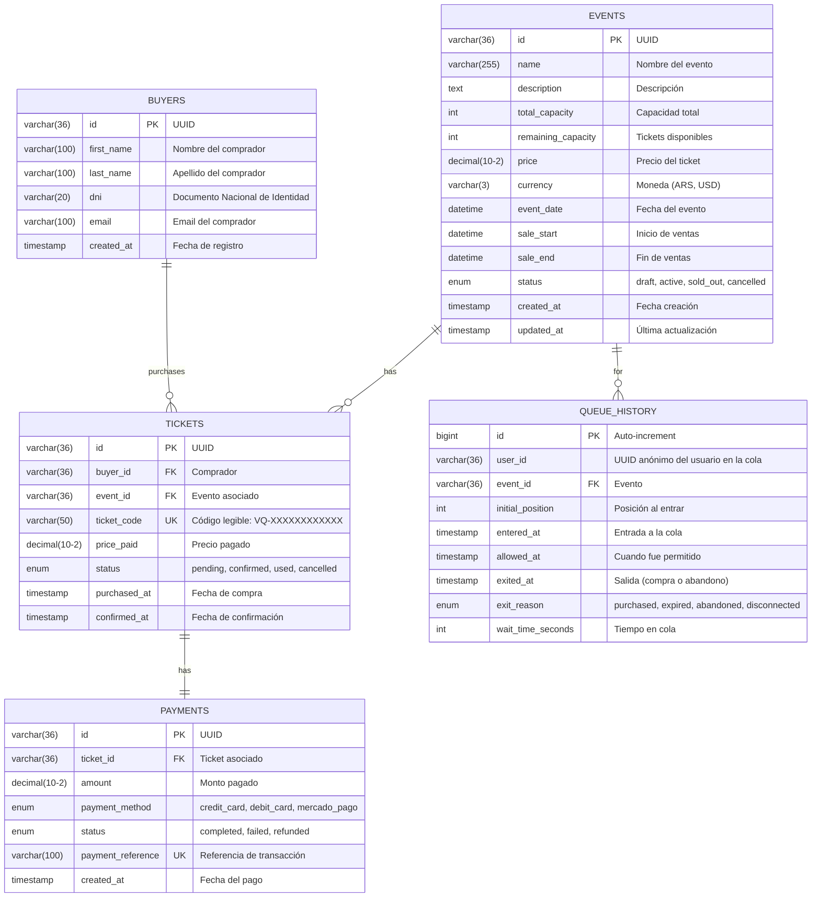

# Diagrama Entidad-Relación (MySQL)
<div style="width: 140%;">

## Descripción

Este diagrama muestra el modelo de datos relacional para la persistencia en MySQL.

## Diagrama ER



## Índices Recomendados

```sql
-- BUYERS
CREATE INDEX idx_buyers_dni ON buyers(dni);
CREATE INDEX idx_buyers_email ON buyers(email);

-- EVENTS
CREATE INDEX idx_events_status ON events(status);
CREATE INDEX idx_events_sale_dates ON events(sale_start, sale_end);
CREATE INDEX idx_events_event_date ON events(event_date);

-- TICKETS
CREATE INDEX idx_tickets_buyer ON tickets(buyer_id);
CREATE INDEX idx_tickets_event ON tickets(event_id);
CREATE INDEX idx_tickets_status ON tickets(status);
CREATE INDEX idx_tickets_code ON tickets(ticket_code);

-- PAYMENTS
CREATE INDEX idx_payments_ticket ON payments(ticket_id);
CREATE INDEX idx_payments_reference ON payments(payment_reference);

-- QUEUE_HISTORY
CREATE INDEX idx_queue_user_event ON queue_history(user_id, event_id);
CREATE INDEX idx_queue_entered ON queue_history(entered_at);
CREATE INDEX idx_queue_exit_reason ON queue_history(exit_reason);
```

## Notas de Diseño

### Race Condition en Compras

Para evitar sobreventa, la compra usa `SELECT ... FOR UPDATE`:

```sql
BEGIN TRANSACTION;

-- Bloquea la fila del evento
SELECT remaining_capacity 
FROM events 
WHERE id = ? 
FOR UPDATE;

-- Verifica capacidad
-- Si remaining_capacity > 0:

INSERT INTO buyers (id, first_name, last_name, dni, email) VALUES (...);
INSERT INTO tickets (id, buyer_id, event_id, ...) VALUES (...);
INSERT INTO payments (id, ticket_id, amount, payment_method, ...) VALUES (...);

UPDATE events 
SET remaining_capacity = remaining_capacity - 1 
WHERE id = ?;

COMMIT;
```

### Particionamiento Sugerido (Escala Futura)

```sql
-- Particionar queue_history por mes (tabla histórica grande)
ALTER TABLE queue_history 
PARTITION BY RANGE (UNIX_TIMESTAMP(entered_at)) (
    PARTITION p_2024_01 VALUES LESS THAN (UNIX_TIMESTAMP('2024-02-01')),
    PARTITION p_2024_02 VALUES LESS THAN (UNIX_TIMESTAMP('2024-03-01')),
    -- ...
);
```
