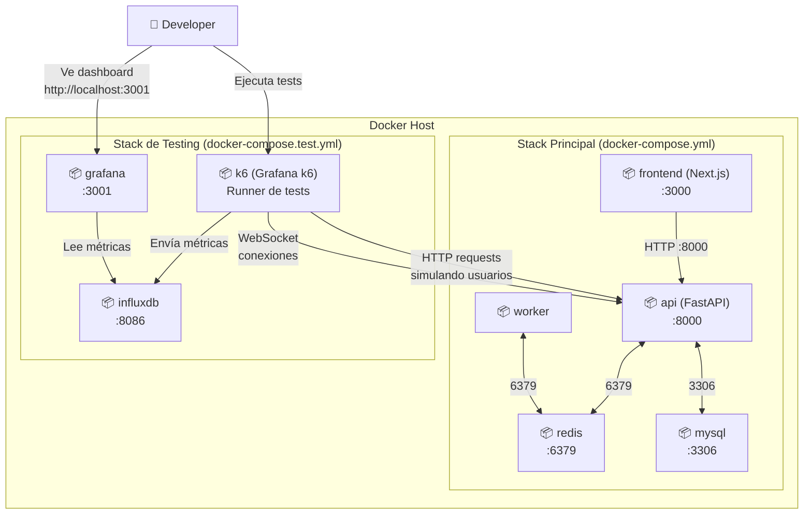
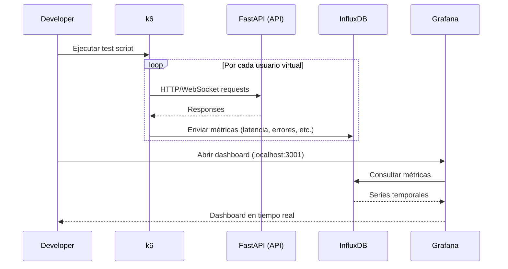

# Diagrama de Infraestructura de Testing

## Descripción

Este diagrama muestra la arquitectura de contenedores Docker para el entorno de load testing con k6, Grafana e InfluxDB.

## Diagrama de Contenedores — Stack de Testing



## Flujo de Datos del Testing



## Red Docker

Todos los contenedores (tanto del stack principal como del stack de testing) están conectados a la misma red `virtual-queue-network`. Esto permite que k6 acceda a la API por nombre de host (`http://api:8000`) sin exponer puertos adicionales.

```
┌─────────────────────────────────────────────────────────┐
│                virtual-queue-network (bridge)            │
│                                                          │
│  Stack Principal         Stack de Testing                │
│  ┌────────────┐         ┌────────────┐                  │
│  │ frontend   │         │ k6 ────────│──► api           │
│  │ api        │◄────────│            │                  │
│  │ worker     │         │ influxdb ◄─│── k6 (métricas)  │
│  │ redis      │         │            │                  │
│  │ mysql      │         │ grafana ───│──► influxdb      │
│  └────────────┘         └────────────┘                  │
└─────────────────────────────────────────────────────────┘
```

## Comandos de Testing

```bash
# ── Preparación ─────────────────────────────────

# 1. Levantar stack principal
docker-compose up -d

# 2. Levantar Grafana + InfluxDB (sin k6, que corre bajo demanda)
docker-compose -f docker-compose.test.yml up -d grafana influxdb

# 3. Abrir Grafana
# http://localhost:3001 (usuario: admin, password: admin)

# ── Ejecutar Tests ─────────────────────────────

# Smoke test (10 usuarios, 30 segundos)
docker-compose -f docker-compose.test.yml run k6 run /scripts/smoke-test.js

# Test de endpoints individuales (~14 minutos)
docker-compose -f docker-compose.test.yml run k6 run /scripts/endpoints-test.js

# Test de flujo completo con WebSocket (~6 minutos)
docker-compose -f docker-compose.test.yml run k6 run /scripts/full-flow-test.js

# Stress test: 0 → 10.000 gradual (~12 minutos)
docker-compose -f docker-compose.test.yml run k6 run /scripts/stress-test.js --env SCENARIO=stress

# Spike test: 0 → 10.000 de golpe (~2 minutos)
docker-compose -f docker-compose.test.yml run k6 run /scripts/stress-test.js --env SCENARIO=spike

# Stress + Spike juntos (~15 minutos)
docker-compose -f docker-compose.test.yml run k6 run /scripts/stress-test.js

# ── Limpieza ───────────────────────────────────

# Detener stack de testing
docker-compose -f docker-compose.test.yml down

# Detener todo (principal + testing)
docker-compose down && docker-compose -f docker-compose.test.yml down

# Eliminar datos de métricas
docker-compose -f docker-compose.test.yml down -v
```
