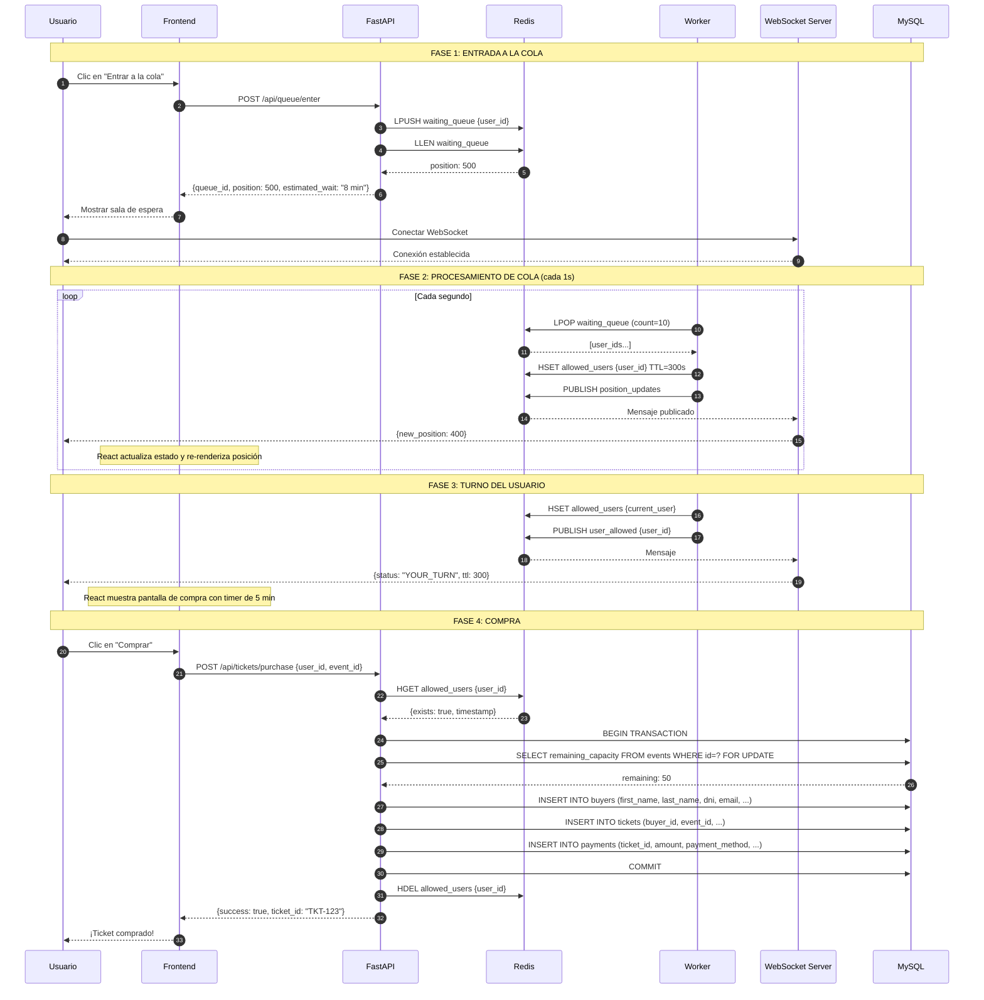
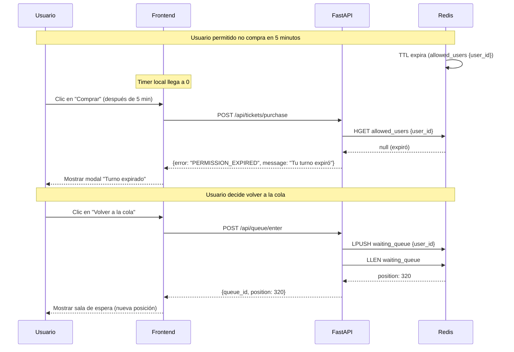
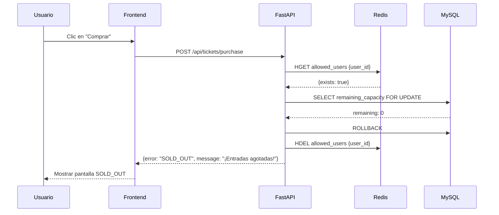
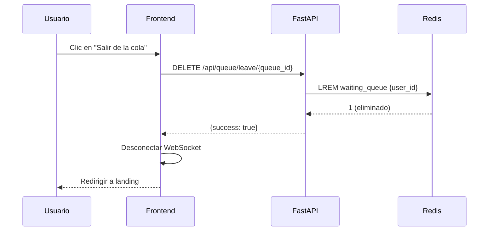

# Diagrama de Secuencia: Flujo Completo de la Cola

## Descripción

Este diagrama muestra el flujo completo desde que un usuario entra a la cola hasta que compra su ticket.

## Diagrama Principal

### Explicación del Flujo Principal

**FASE 1 — Entrada a la cola (pasos 1-9)**

El usuario hace clic en "Entrar a la cola" desde el Frontend (React). El Frontend envía un `POST /api/queue/enter` a FastAPI. FastAPI ejecuta dos operaciones en Redis: primero `LPUSH` para agregar al usuario al final de la lista `waiting_queue`, y luego `LLEN` para obtener la longitud actual de la cola (que equivale a la posición del usuario). Redis responde con la posición (ej: 500). FastAPI le devuelve al Frontend la posición, un `queue_id` identificador y un tiempo estimado de espera. El Frontend muestra la sala de espera y abre una conexión WebSocket directa desde el browser hacia el WebSocket Server para recibir actualizaciones en tiempo real.

**FASE 2 — Procesamiento de cola (pasos 10-16)**

Este es un loop que el Worker ejecuta cada segundo. El Worker hace `LPOP` para sacar un lote de hasta 10 usuarios del frente de la cola. Por cada usuario sacado, ejecuta `HSET` para moverlo a la estructura `allowed_users` (un HASH con TTL de 5 minutos). Luego publica un mensaje de actualización de posiciones vía `PUBLISH` (Pub/Sub de Redis). El WebSocket Server, que está suscrito a ese canal, recibe el mensaje y lo reenvía a todos los usuarios conectados con su nueva posición. El Frontend (React) recibe el dato vía WebSocket y actualiza el estado interno, re-renderizando la posición en pantalla — esto es un proceso interno de React, no una comunicación entre participantes.

**FASE 3 — Turno del usuario (pasos 17-21)**

Cuando el Worker saca al usuario actual de la cola y lo mueve a `allowed_users`, publica un mensaje específico `user_allowed` con el `user_id`. El WebSocket Server recibe este mensaje y le envía al usuario `{status: "YOUR_TURN", ttl: 300}`. El Frontend recibe el evento y muestra la pantalla de compra con un timer regresivo de 5 minutos.

**FASE 4 — Compra (pasos 22-30)**

El usuario hace clic en "Comprar". El Frontend envía `POST /api/tickets/purchase` a FastAPI. FastAPI primero verifica en Redis que el usuario tenga permiso: ejecuta `HGET allowed_users {user_id}`. Si Redis confirma que el usuario está en `allowed_users` (es decir, es su turno y no expiró), FastAPI inicia una transacción en MySQL. Dentro de la transacción: hace un `SELECT ... FOR UPDATE` para bloquear la fila del evento y leer la capacidad restante, ejecuta el `INSERT` del ticket y decrementa la capacidad con `UPDATE`. Si todo sale bien, hace `COMMIT`.

Después del commit exitoso, FastAPI ejecuta `HDEL allowed_users {user_id}` en Redis. Es importante aclarar que **`HDEL` no elimina al usuario de la cola** (`waiting_queue`) — el usuario ya fue sacado de ahí por el Worker con `LPOP` en la Fase 2. Lo que `HDEL` hace es eliminarlo de `allowed_users`, que es la estructura de **usuarios con permiso para comprar**. Es una limpieza: el usuario ya compró, no necesita seguir en la lista de permitidos. Si no se hiciera, el TTL de 5 minutos eventualmente lo limpiaría, pero es buena práctica borrarlo inmediatamente.

Finalmente, FastAPI responde al Frontend con el resultado exitoso y el ID del ticket. El Frontend muestra "¡Ticket comprado!" al usuario.

## Escenarios Alternativos

### Escenario: TTL Expirado

**Explicación del flujo:**

El usuario estaba en la pantalla de compra con un timer de 5 minutos, pero no completó la compra a tiempo. En Redis, el TTL de 5 minutos (300 segundos) del key `allowed_users {user_id}` expira automáticamente y el key desaparece. En paralelo, el timer local del Frontend (hook `useCountdown`) llega a 0. Aunque el Frontend podría mostrar un aviso proactivamente al llegar a 0, en este escenario el usuario intenta comprar de todos modos. FastAPI consulta `HGET allowed_users` y Redis responde `null` porque el key ya expiró. FastAPI rechaza la compra con error `PERMISSION_EXPIRED` y el Frontend muestra un modal informándole que su turno expiró. No interviene el Worker ni el WebSocket porque no hay nada que procesar ni notificar — la expiración fue automática de Redis y la verificación es una respuesta directa a la acción del usuario. Si el usuario decide volver a entrar, se repite el flujo de entrada de la Fase 1 del diagrama principal, obteniendo una nueva posición al final de la cola.

### Escenario: Capacidad Agotada

**Explicación del flujo:**

El usuario tiene permiso para comprar (está en `allowed_users`) y hace clic en "Comprar". FastAPI primero verifica en Redis con `HGET` que el usuario efectivamente tiene permiso — Redis confirma que sí. Luego FastAPI inicia la transacción en MySQL y ejecuta `SELECT remaining_capacity FOR UPDATE`, que bloquea la fila del evento para evitar race conditions. MySQL responde que la capacidad restante es 0 — no quedan entradas. FastAPI ejecuta `ROLLBACK` para deshacer la transacción (en este caso no se modificó nada, pero es buena práctica cerrarla explícitamente). A continuación, FastAPI hace `HDEL allowed_users {user_id}` para eliminar al usuario de la lista de permitidos, ya que su intento de compra falló y no tiene sentido que conserve el permiso. Finalmente, FastAPI responde con error `SOLD_OUT` y el Frontend muestra la pantalla de entradas agotadas. No interviene el Worker ni el WebSocket porque es una interacción directa usuario → API → base de datos, y el resultado es definitivo: no hay entradas disponibles.

### Escenario: Usuario Abandona la Cola

**Explicación del flujo:**

El usuario decide abandonar la cola voluntariamente y hace clic en "Salir de la cola". El Frontend envía un `DELETE /api/queue/leave/{queue_id}` a FastAPI. FastAPI ejecuta `LREM waiting_queue {user_id}` en Redis, que busca y remueve al usuario de la cola desde cualquier posición. Redis responde con `1` confirmando que encontró y eliminó al usuario. FastAPI responde al Frontend con éxito. A continuación, el Frontend cierra la conexión WebSocket internamente (`websocket.close()`) — la flecha `F → F` representa esta acción propia del Frontend, no una comunicación entre participantes. Cuando la conexión se cierra, el WebSocket Server detecta el cierre del lado servidor, pero no necesita hacer nada (no marca al usuario en `disconnected_users` ni inicia un timer) porque el usuario ya fue removido de la cola con `LREM`. Finalmente, el Frontend redirige al usuario a la página de landing.

