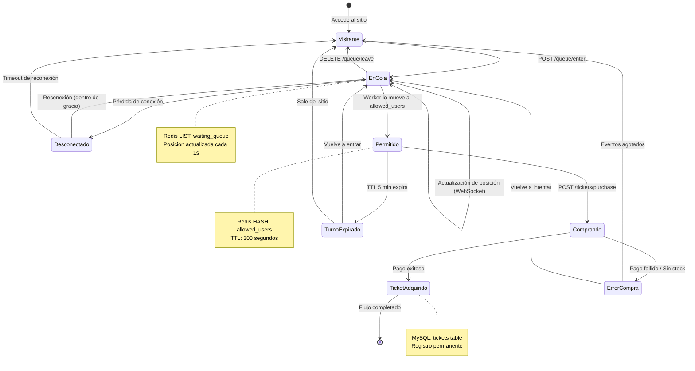
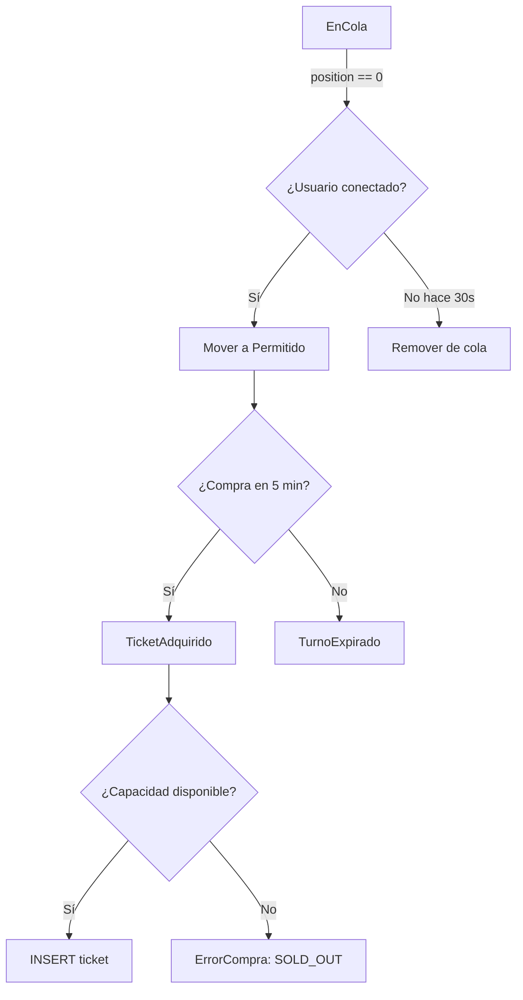
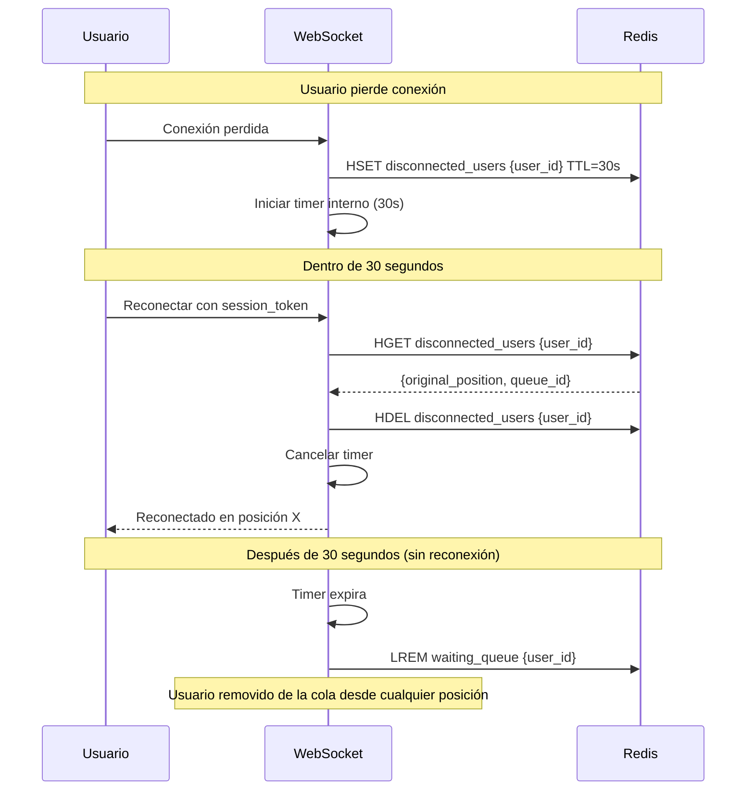

# Diagrama de Estados del Usuario

## Descripción

Este diagrama muestra todos los estados posibles de un usuario en el sistema y las transiciones entre ellos.

## Diagrama Principal

## Tabla de Estados

| Estado | Almacenamiento | Duración | Acciones Permitidas |
|--------|----------------|----------|---------------------|
| **Visitante** | Ninguno | Indefinida | Ver eventos, entrar a cola |
| **EnCola** | Redis LIST | Hasta ser llamado | Ver posición, salir de cola |
| **Desconectado** | Redis LIST (persiste) | 30s gracia | Reconectar |
| **Permitido** | Redis HASH + TTL | 5 minutos | Comprar ticket |
| **TurnoExpirado** | Ninguno | - | Volver a entrar |
| **Comprando** | Transacción MySQL | Segundos | Esperar resultado |
| **ErrorCompra** | Log en MySQL | - | Reintentar o salir |
| **TicketAdquirido** | MySQL tickets | Permanente | Ver/descargar ticket |

## Transiciones con Condiciones

## Manejo de Reconexión

### Explicación del Flujo

1. La conexión se cae → **WebSocket Server** detecta el cierre internamente.
2. **WS → Redis**: marca al usuario en `disconnected_users` con TTL de 30s (período de gracia).
3. **WS → WS**: inicia un timer interno de 30 segundos.

**Camino A — reconecta a tiempo:**

4. El usuario reconecta con su `session_token`.
5. **WS → Redis**: consulta `disconnected_users` → obtiene su posición original y `queue_id`.
6. **WS → Redis**: elimina el registro de `disconnected_users` (`HDEL`).
7. **WS** cancela el timer y le confirma al usuario su posición restaurada.

**Camino B — no reconecta en 30 segundos:**

8. El timer expira internamente en el WebSocket Server.
9. **WS → Redis**: ejecuta `LREM waiting_queue {user_id}` → lo elimina de la cola desde cualquier posición.
10. Las posiciones de los demás usuarios se actualizan automáticamente en el próximo ciclo del Worker (máximo 1 segundo después).
